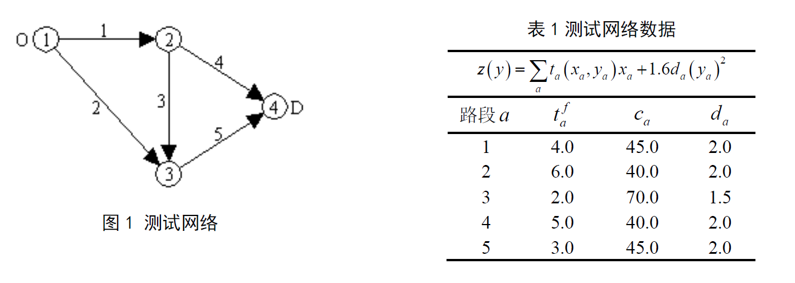
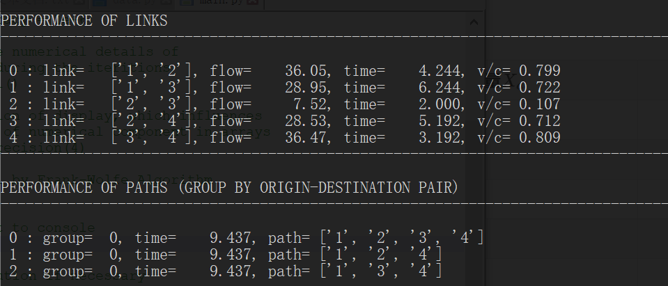
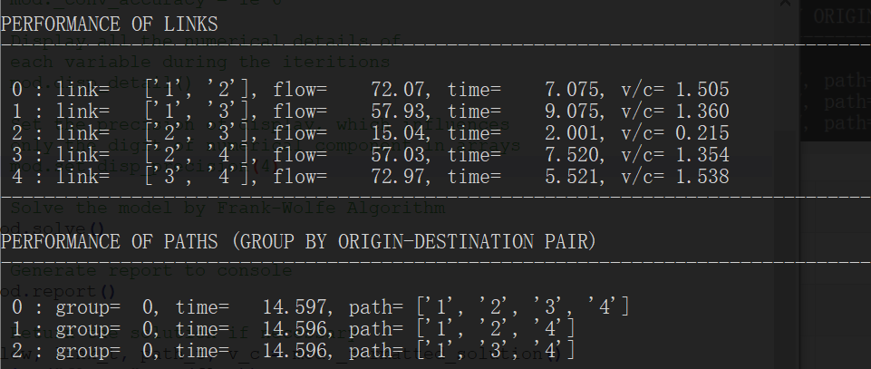
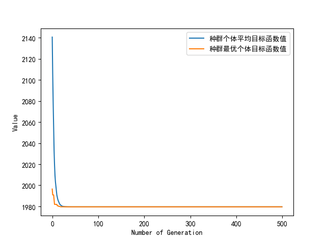
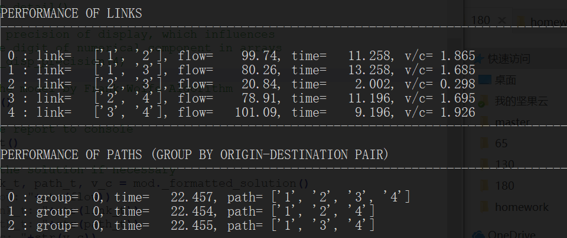
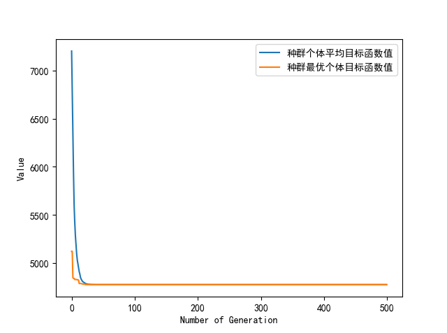

## 1 题目描述

> 网络基本情况

图1 所示的标准测试网络（Suwansirikul,Friesz & Tobin,1987），包括4 个节点，5 条路段和1个OD 对 w (1→4)，需求为65, 130, 180(考虑三种需求情况)。网络设计的目标函数形式及各路段的参数值如 表1 所示。




> 符号表示约定

- $A$ 表示路段的集合，$a$ 、$b$ 表示 $A$ 中的元素；
- $W$ 表示路网中的OD对集合，$w$ 表示$W$中的一个元素；
- $R_w$ 表示OD对 $w$ 之间的路经集合，$r$ 、$k$ 表示 $R_w$ 中的元素；
- $t(·)$ 表示路段 $a$ 的走行时间函数；
- $x_a$ 表示路段 $a$ 上的交通流量；
- $c_a$ 表示路段 $a$ 的通行能力；
- $y_a$ 是路段 $a$ 通行能力的增加值；
- $g_a(y_a)=d_a(y_a)^2$ 是路段 $a$ 改造的投资函数；
- $\delta_{ar}$ 是0-1变量，如果路径 $r$ 使用路段 $a$ 则为 1，否则为 0；
- $q_w$ 表示OD对 $w$ 之间交通量；
- $f_{wr}$ 表示OD对 $w$ 之间路径 $r$ 上的交通流量；
- $c_{wr}$ 表示OD对 $w$ 之间路径 $r$ 上的实际走行时间。


## 2 交通分配模型及算法

> 给出基于UE或SUE的交通分配模型及算法，并进行详细的说明；

### 2.1 Wardrop平衡原理

在实际交通网络中，如果两点之间有很多条道路而这两点之间的交通量又很少的话，行驶车辆显然会沿着最短的道路行走。随着交通量的增加，最短径路上的交通流量也会随之增加。增加到一定程度之后，这条最短径路的行驶时间会因为拥挤或堵塞而变长，最短径路发生变化，这一部分行驶车辆将会选择新的行驶时间次短的道路。随着两点之间的交通量继续增加。两点之间的所有道路都有可能被利用。

如果所有的道路利用者（即驾驶员）都准确知道各条道路所需的行驶时间并选择行驶时间最短的道路，最终两点之间被利用的各条道路的行驶时间会相等。没有被利用的道路的行驶时间更长。这种状态被称之为道路网的平衡状态。

1952年著名学者Wardrop提出了交通网络平衡定义的第一原理和第二原理，奠定了交通流分配的基础。

> **Wardrop第一原理**

在道路的利用者都确切知道网络的交通状态并试图选择最短径路时，网络将会达到平衡状态。在考虑拥挤对行驶时间影响的网络中，当网络达到平衡状态时，每个0D对的各条被使用的径路具有相等而且最小的行驶时间；没有被使用的径路的行驶时间大于或等于最小行驶时间。

Wardrop第一原理在实际交通流分配中也称为用户均衡（User Equilibrium，UE）或用户最优。

> **Wardrop第二原理**

系统平衡条件下，拥挤的路网上交通流应该按照平均或总的出行成本最小为依据来分配。

Wardrop第二原理在实际交通流分配中也称为系统最优原理（SystemOptimization，SO）。

由于问题的复杂性，从1952年Wardrop提出道路网平衡的概念和定义之后，如何求解Wardrop平衡成了研究者的重要课题。而描述该平衡交通流分配的数学规划模型，在1956年由Beckmann等人提出。


### 2.2 Beckmann交通平衡分配模型

Beckmann模型是对Wardrop平衡原理的一次成功数学语言描述，模型用取目标函数极小值的方法来求解平衡分配问题，具体的模型如下：

> Beckmann模型


$$
\min : \quad Z(X)=\sum_{a} \int_{0}^{x_{a}} t_{a}(\omega) \mathrm{d} \omega
\tag{2-1}
$$

$$
\text { s.t. }
\left\{\begin{array}{l}
\sum\limits_{k} f_{k}^{rs}=q_{rs} \\
f_{k}^{rs} \geqslant 0
\end{array}\right. 
\tag{2-2}
$$

$$
x_{a}=\sum_{r} \sum_{s} \sum_{k} f_{k}^{rs} \delta_{a, k}^{rs}  
\tag{2-3}
$$

- $x_a$——路段a上的交通量
- $t_a(x_a)$——路段a以流量为自变量的阻抗函数，也称为行驶时间函数；
- $f_k^{rs}$——出发地为r目的地为s的OD间的第k条径路上的流量；
- $q_{rs}$——出发地r和目的地s之间的OD交通量；
- $\delta_{a, k}^{rs}$——路段-径路相关变量，即0-1变量


> 模型分析

分析上述模型，可以看到模型的目标函数 (2-1)​ 是对各路段的行驶时间函数积分求和之后取最小值，很难对它做出直观的物理解释，一般认为它只是一种数学手段，借助它来求解平衡分配问题。

其次，平衡分配过程中应该满足交通流守恒的条件，即OD间各条径路上的交通量之和应等于OD交通总量；此外，径路流量应该满足非负约束，用公式可以表示为 (2-2)​ 所示。

最后，径路交通量$f_k^{rs}$和路段交通量$x_a$。之间应该满足如下的条件，即路段上的流量应该是由各个$(r,s)$对的途经该路段的径路的流量累加而成，公式表示为 (2-3) 。


### 2.3 Frank-Wolfe算法

1956年，Beckmann提出的上述数学规划模型沉睡了20 年之后，即直到1975年，才由LeBlanc等学者利用Frank-Wolfe算法实现模型的求解，最终形成了目前广泛应用的一种解法，通常称为F-W解法。

F-W方法的前提是模型的约束条件必须都是线性的。该方法是用线性规划逐步逼近非线性规划的方法，它是一种迭代法。在每步迭代中，先找到目标函数一个最速下降的方向，然后再找到一个最优步长，在最速下降方向上截取最优步长得到下一步迭代的起点，重复迭代直到找到最优解为止。

概括而言，该方法的基本思路就是根据一个线性规划的最优解而确定下一步的迭代方向，然后根据目标函数的一维极值问题求最优迭代步长。

> 算法步骤

1. 初始化：按照$t_a^0=t_a(0), \forall a$，进行0-1交通流分配，得到各路段的流量$\{x_a^1\}, \forall a$；令$n=1$。

2. 更新各路段的阻抗：$t_a^n=t_a(x_a^n), \forall a$。

3. 寻找下一步迭代方向：按照更新后的$\{t_a^n\}, \forall a$，再进行一次0-1交通流分配，得到一组附加流量$\{y_a^n\}$。

4. 确定迭代步长：用二分法求满足下式的λ：
	$$
	\sum_{a}\left(y_{a}^{n}-x_{a}^{n}\right) t_{a}\left[x_{a}^{n}+\lambda\left(y_{a}^{n}-x_{a}^{n}\right)\right]=0
	$$

5. 确定新的迭代起点：$x_a^{n+1}= x_a^n+\lambda(y_a^n-x_a^n)$。

6. 收敛性检验。如果满足：$\frac{\sqrt{\sum\limits_{a}\left(x_{a}^{n+1}-x_{a}^{n}\right)^{2}}}{\sum\limits_{a} x_{a}^{n}}<\varepsilon$，其中 $\varepsilon$ 是预先给定的误差限值，则$\{x_a^{n+1}\}$就是要求的平衡解，计算结束；否则，令$n=n+1$，返回步骤2。


> 算法分析

从上述步骤可以看出，平衡分配法和非平衡分配法中的迭代加权法（MSA法）十分相似，唯一的区别就是平衡分配法通过严格的数学运算求得迭代步长，因而就能保证求出平衡解；而MSA法迭代步长为1/n，因而能求出近似平衡解，也能收敛到精确平衡解。

F-W平衡分配算法问世后，使得大规模网络的交通流分配问题的计算成为可能，因此作为实用性交通流分配方法获得了快速发展。


## 3 网络设计模型及算法

> 建立基于（1）中分配模型的网络设计模型和算法（IOA或者GA），并给予详细的说明；

### 3.1 多层规划问题

多层规划是广泛应用于解决多层决策问题的一种数学模型，在多层规划模型中，各个层次的决策者都有其各自的目标函数，在某种程度上，本层的决策空间是由其他层次决定的。

此外，某一层次的决策者通过特定的方法和手段以影响其他各层的决策制定，从而达到优化其自身目标函数的目的。另一个重要特点是：决策变量的控制权分别属于各层的决策者，而在传统的单层规划中，决策者同时控制所有的决策变量。

在多层规划中，以优化自己的目标函数为目的的决策者，在高层决策者事先确定决策变量值之后，对自已能控制的决策变量进行优化，以达到最优目的。多层规划比单层规划具有优势，包括能够明确建模表示顺序决策过程的能力，能够明确表示不同层次优化过程或不同决策系统之间的相互作用的能力。


### 3.2 双层规划模型的网络设计应用

交通网络设计问题（Network Design Problem, NDP）被认为是一个两层决策问题，上层是交通管理者，下层是交通网络上的用户。上层交通管理者通过交通网络的改造去影响下层用户的路径选择行为，从而去优化上层交通管理者的目标，而下层用户依据上层的交通管理者的决策去选择路径，使得自己的效用达到最大（最小的路径走行时间）而不管其它的外部影响。即处于下层的网络出行者在上层决策者给定路段能力的情况下，其路径选择行为通常符合UE准则。

在本设计中使用的下层模型为固定需求条件下的用户平衡模型。

对于上层的决策变量及目标函数，其模型会有很大的差异。在交通网络设计问题中，有两种投资策略，一种是投资改进现有网络中的某些路段，增加其能力，另一种是在现有网络中增加新的路段。与此相对应，上层决策变量主要有三种形式，如下：

- 离散形式的上层决策变量。
	- 早期的网络设计问题主要关注的是如何在现有网络中==增加新的路段==以使整个网络性能达到最优。与采用离散决策变量对应的网络设计问题被称为离散网络设计问题，特别适合于新的交通网络建设最优投资问题。
- 连续形式的上层决策变量。
	- 采用连续决策变量的交通网络设计问题被称为连续网络设计问题，它主要研究如何==投资、改善现有网络中某些路段==以使整个网络性能达到最优的目的，适合于道路网络中的道路扩建及信号控制和匝道合并等问题。
- 混合形式的上层决策变量。
	- 由于实际的交通网络设计问题==既涉及到在现有网络中增加新的路段，又包括改善现有网络中某些路段==，因此，为了使模型能够更加现实的反映实际，在网络设计模型中就必须同时包括连续决策变量和离散决策变量。与此对应的网络设计问题被称为混合网络设计问题。

在本设计中使用的上层决策变量为连续性的上层决策变量；使用的上层模型是目标函数为考虑多部门、多机构在总体目标一致条件下的整体效益最优的多目标优化模型。


### 3.3 交通网络设计模型

> 双层规划模型

根据题目要求的目标函数，具体的双层规划模型如下所示，

上层模型：
$$
\min \quad \mathrm{Z}(\mathrm{x}, \mathrm{y})=\sum_{a \in A} t_{a}\left(x_{a}, y_{a}\right) x_{a} + 1.6 \sum_{a \in A} d_{a}\left(y_{a}\right)^2
\tag{3-1}
$$

$$
\text {s.t.} \quad    \underline{y}_{a} \leq y_{a} \leq \overline{y}_{a}    \quad \forall a \in A
\tag{3-2}
$$

其中 $x_a=x(y_a)$ 是 $y_a$ 的隐函数，由下层模型模型决定，

下层模型：
$$
\min \quad \mathrm{Z}(x, y)=\sum_{a \in A} \int_{0}^{x_{a}} t_{a}\left(w, y_{a}\right) d w
\tag{3-3}
$$

$$
\text { s.t. } \quad \sum_{R_{w}} f_{w r}=q_{w} \quad \forall r \in R_{W}
\tag{3-4}
$$

$$
f_{w r} \geq 0 \quad \forall w \in W, r \in R_{W}
\tag{3-5}
$$

$$
x_{a}=\sum_{w} \sum_{r \in R_{W}} f_{w r} \delta_{ar}^{w} \quad \forall w \in W, r \in R_{W}
\tag{3-6}
$$


> 模型分析

- 该双层规划模型中的上层目标函数实现多目标优化的效果，即综合考虑交通服务水平和交通建设投资成本总体最优；
- 随着投资成本的增加，即 $y_a$ 增加，被投资路段的通行能力 $x_a$ 增大，路段的通行时间 $t_a(·)$ 会相应地减少；
- 上层决策变量 $y_a$ 的变化影响着下层决策变量 $x_a$，二者相互作用约束，顶层网络设计者可通过调整 $y_a$ 来实现总体成本最优化；
- 本设计题目中未对路段通行时间函数 $t_a(·)$ 给出明确规定，故该设计中使用BPR函数作为路段通行时间函数：

$$
t_a = t_a^f[1+0.15(\frac{x_a}{c_a})^4]
\tag{3-7}
$$


### 3.4 遗传算法

> 遗传算法定义

遗传算法（Genetic Algorithm, GA）是模拟达尔文生物进化论的自然选择和遗传学机理的生物进化过程的计算模型，是一种通过模拟自然进化过程搜索最优解的方法。

其主要特点是直接对结构对象进行操作，不存在求导和函数连续性的限定；具有内在的隐并行性和更好的全局寻优能力；采用概率化的寻优方法，不需要确定的规则就能自动获取和指导优化的搜索空间，自适应地调整搜索方向。

遗传算法以一种群体中的所有个体为对象，并利用随机化技术指导对一个被编码的参数空间进行高效搜索。其中，选择、交叉和变异构成了遗传算法的遗传操作；参数编码、初始群体的设定、适应度函数的设计、遗传操作设计、控制参数设定五个要素组成了遗传算法的核心内容。


> 算法原理

遗传算法是从代表问题可能潜在的解集的一个种群（population）开始的，而一个种群则由经过基因（gene）编码的一定数目的个体(individual)组成。每个个体实际上是染色体(chromosome)带有特征的实体。

染色体作为遗传物质的主要载体，即多个基因的集合，其内部表现（即基因型）是某种基因组合，它决定了个体的形状的外部表现，如黑头发的特征是由染色体中控制这一特征的某种基因组合决定的。因此，在一开始需要实现从表现型到基因型的映射即编码工作。由于仿照基因编码的工作很复杂，我们往往进行简化，如二进制编码。

初代种群产生之后，按照适者生存和优胜劣汰的原理，逐代（generation）演化产生出越来越好的近似解，在每一代，根据问题域中个体的适应度（fitness）大小选择（selection）个体，并借助于自然遗传学的遗传算子（genetic operators）进行组合交叉（crossover）和变异（mutation），产生出代表新的解集的种群。

这个过程将导致种群像自然进化一样的后生代种群比前代更加适应于环境，末代种群中的最优个体经过解码（decoding），可以作为问题近似最优解。


> 算法流程

- Step1：首先针对预解决问题的优化变量进行某种形式的编码，编码要能反应问题的解空间；
- Step2：根据实际问题的优化目标，确定问题的适应度函数；
- Step3：由将群体中的个体代入优化问题的目标函数，计算每个个体的适应度值；
- Step4：由计算出的适应度值来评价染色体的优劣，若满足问题的优化精度或达到最大迭代次数，则就输出最优的问题的解；否则，迭代次数增加1，对染色体进行遗传操作；
- Step5：选择操作：以一定的方式选择一定数量的较优个体进行交叉操作；
- Step6：交叉操作：对于选择出的较优个体按照一定的方式进行交叉操作，以产生种群的多样性；
- Step7：变异操作：对于交叉操作完后的部分染色体再进行变异操作，进一步扩展种群的多样性，然后进入Step3。


## 4 模型求解

### 4.1 模型性质

- 该双层规划模型包括上层——总目标成本最低，以及下层——用户均衡两个部分
- 对于下层模型，使用前文所述的F-W算法求解
- 对于上层模型，使用题目要求的GA算法求解

由于下层模型的自变量$x_a$可通过上层模型的主要自变量$y_a$利用用户均衡求解，$x_a$和$y_a$之间存在等式约束，故该模型本质上属于“连续型决策变量最小化目标的单目标优化问题”。


### 4.2 模型求解结果

> 算法参数

- 遗传算法设置进化代数MAXGEN=500
- 种群规模NIND设置为50
- 遗传过程设置变异概率为0.7
- 总评价次数25000次
- 为提高求解效率，设置 $y_a$ 的自变量区间为[0, 30]


> $q_w=65$ 求解结果

- 最优的目标函数值为：$Z(x,y)=613.539$

- 路段流量、路段能力、各路径通行时间情况：

	
	
- GA算法求解过程

	

- 信息汇总表

	| 路段a(容量) | 流量$X_a$ | 扩建容量$Y_a$ | 流量/容量 |
	| :---------: | :-------: | :-----------: | :-------: |
	|    1(45)    |   36.05   |    0.1223     |   0.799   |
	|    2(40)    |   28.95   |    0.1099     |   0.722   |
	|    3(70)    |   7.52    |    0.0000     |   0.107   |
	|    4(40)    |   28.53   |    0.0852     |   0.712   |
	|    5(45)    |   36.47   |    0.0975     |   0.809   |


> $q_w=130$ 求解结果

- 最优的目标函数值为：$Z(x,y)=1979.564$

- 路段流量、路段能力、各路径通行时间情况：

	
	
- GA算法求解过程

	

- 信息汇总表

	| 路段a(容量) | 流量$X_a$ | 扩建容量$Y_a$ | 流量/容量 |
	| :---------: | :-------: | :-----------: | :-------: |
	|    1(45)    |   72.07   |    2.8996     |   1.505   |
	|    2(40)    |   57.93   |    2.6064     |   1.360   |
	|    3(70)    |   15.04   |     0.000     |   0.215   |
	|    4(40)    |   57.03   |    2.1251     |   1.354   |
	|    5(45)    |   72.97   |    2.4300     |   1.538   |


> $q_w=180$ 求解结果

- 最优的目标函数值为：$Z(x,y)=4774.570$

- 路段流量、路段能力、各路径通行时间情况：

	
	
- GA算法求解过程

	
	
- 信息汇总表

	| 路段a(容量) | 流量$X_a$ | 扩建容量$Y_a$ | 流量/容量 |
	| :---------: | :-------: | :-----------: | :-------: |
	|    1(45)    |   99.74   |    8.4828     |   1.865   |
	|    2(40)    |   80.26   |    7.6246     |   1.685   |
	|    3(70)    |   20.84   |    0.0001     |   0.298   |
	|    4(40)    |   78.91   |    6.5432     |   1.695   |
	|    5(45)    |  101.09   |    7.4799     |   1.926   |


## 5 附件

### 5.1 graph.py

- Graph类和TrafficNetwork子类，可利用传入的网络信息生成对应的交通网络实例

```python
# -*- coding: utf-8 -*-
class Graph(object):
    """ DIRECTED GRAPH CLASS

    A simple Python graph class, demonstrating the essential 
    facts and functionalities of directed graphs, and it is
    designed for our traffic flow assignment problem, thus we
    have the following assumptions:

    1. The graph contains no self-loop, that is, an edge that 
    connects a vertex to itself;

    2. There is at most one edge which connects two vertice;

    Revised from: https://www.python-course.eu/graphs_python.php
    and in our case we must give order to all the edges, thus we
    do not use the unordered data structure.
    """

    def __init__(self, graph_dict= None):
        """ initializes a directed graph object by a dictionary,
            If no dictionary or None is given, an empty dictionary 
            will be used. Notice that this initial graph cannot
            contain a self-loop.
        """
        from collections import OrderedDict
        if graph_dict == None:
            graph_dict = OrderedDict()
        self.__graph_dict = OrderedDict(graph_dict)
        if self.__is_with_loop():
            raise ValueError("The graph are supposed to be without self-loop please recheck the input data!")

    def vertices(self):
        """ returns the vertices of a graph
        """
        return list(self.__graph_dict.keys())

    def edges(self):
        """ returns the edges of a graph
        """
        return self.__generate_edges()

    def add_vertex(self, vertex):
        """ If the vertex "vertex" is not in 
            self.__graph_dict, a key "vertex" with an empty
            list as a value is added to the dictionary. 
            Otherwise nothing has to be done. 
        """
        if vertex not in self.__graph_dict:
            self.__graph_dict[vertex] = []
        else:
            print("The vertex %s already exists in the graph, thus it has been ignored!" % vertex)

    def add_edge(self, edge):
        """ Assume that edge is ordered, and between two 
            vertices there could exists only one edge. 
        """
        vertex1, vertex2 = self.__decompose_edge(edge)
        if not self.__is_edge_in_graph(edge):
            if vertex1 in self.__graph_dict:
                self.__graph_dict[vertex1].append(vertex2)
                if vertex2 not in self.__graph_dict:
                    self.__graph_dict[vertex2] = []
            else:
                self.__graph_dict[vertex1] = [vertex2]
        else:
            print("The edge %s already exists in the graph, thus it has been ignored!" % ([vertex1, vertex2]))

    def find_all_paths(self, start_vertex, end_vertex, path= []):
        """ find all simple paths (path with no repeated vertices)
            from start vertex to end vertex in graph 
        """
        path = path + [start_vertex]
        if start_vertex == end_vertex:
            return [path]
        paths = []
        for neighbor in self.__graph_dict[start_vertex]:
            if neighbor not in path:
                sub_paths = self.find_all_paths(neighbor, end_vertex, path)
                for sub_path in sub_paths:
                    paths.append(sub_path)
        return paths

    def __is_edge_in_graph(self, edge):
        """ Judge if an edge is already in the graph
        """
        vertex1, vertex2 = self.__decompose_edge(edge)
        if vertex1 in self.__graph_dict:
            if vertex2 in self.__graph_dict[vertex1]:
                return True
            else:
                return False
        else:
            return False
    
    def __decompose_edge(self, edge):
        """ Input is a list or a tuple with only two elements
        """
        if (isinstance(edge, list) or isinstance(edge, tuple)) and len(edge) == 2:
            return edge[0], edge[1]
        else:
            raise ValueError("%s is not of type list or tuple or its length does not equal to 2" % edge)

    def __is_with_loop(self):
        """ If the graph contains a self-loop, that is, an 
            edge connects a vertex to itself, then return
            True, otherwise return False
        """
        for vertex in self.__graph_dict:
            if vertex in self.__graph_dict[vertex]:
                return True
        return False

    def __generate_edges(self):
        """ A static method generating the edges of the 
            graph "graph". Edges are represented as list
            of two vertices 
        """
        edges = []
        for vertex in self.__graph_dict:
            for neighbor in self.__graph_dict[vertex]:
                edges.append([vertex, neighbor])
        return edges

    def __str__(self):
        res = "vertices: "
        for k in self.__graph_dict:
            res += str(k) + " "
        res += "\nedges: "
        for edge in self.__generate_edges():
            res += str(edge) + " "
        return res

class TrafficNetwork(Graph):
    ''' TRAFFIC NETWORK CLASS
        Traffic network is a combination of basic graph
        and the demands, the informations about links, paths
        and link-path incidence matrix will be generated
        after the initialization.
    '''

    def __init__(self, graph= None, O= [], D= []):
        Graph.__init__(self, graph)
        self.__origins = O
        self.__destinations = D
        self.__cast()

    # Override of add_edge function, notice that when an edge
    # is added, then the links and paths will changes alongside.
    # However, it doesn't matter when a vertex is added
    def add_edge(self, edge):
        Graph.add_edge(self, edge)
        self.__cast()

    def add_origin(self, origin):
        if origin not in self.__origins:
            self.__origins.append(origin)
            self.__cast()
        else:
            print("The origin %s already exists, thus has been ignored!" % origin)

    def add_destination(self, destination):
        if destination not in self.__destinations:
            self.__destinations.append(destination)
            self.__cast()
        else:
            print("The destination %s already exists, thus has been ignored!" % destination)

    def num_of_links(self):
        return len(self.__links)

    def num_of_paths(self):
        return len(self.__paths)

    def num_of_OD_pairs(self):
        return len(self.__OD_pairs)

    def __cast(self):
        """ Calculate or re-calculate the links, paths and
            Link-Path incidence matrix
        """
        if self.__origins != None and self.__destinations != None:
            # OD pairs = Origin-Destination Pairs
            self.__OD_pairs = self.__generate_OD_pairs()
            self.__links = self.edges()
            self.__paths, self.__paths_category = self.__generate_paths_by_demands()
            # LP Matrix = Link-Path Incidence Matrix
            self.__LP_matrix = self.__generate_LP_matrix()
    
    def __generate_OD_pairs(self):
        ''' Generate the OD pairs (Origin-Destination Pairs)
            by Cartesian production 
        '''
        OD_pairs = []
        for o in self.__origins:
            for d in self.__destinations:
                OD_pairs.append([o, d])
        return OD_pairs

    def __generate_paths_by_demands(self):
        """ According the demands, i.e. the origins and the
            destinations of the traffic flow, to construct a list
            of paths which are necessary for the traffic flow
            assignment model
        """ 
        paths_by_demands = []
        paths_category = []
        od_pair_index = 0
        for OD_pair in self.__OD_pairs:
            paths = self.find_all_paths(*OD_pair)
            paths_by_demands.extend(paths)
            paths_category.extend([od_pair_index] * len(paths))
            od_pair_index += 1
        return paths_by_demands, paths_category

    def __generate_LP_matrix(self):
        """ Generate the Link-Path incidence matrix Delta:
            if the i-th link is on j-th link, then delta_ij = 1,
            otherwise delta_ij = 0
        """
        import numpy as np
        n_links = self.num_of_links()
        n_paths = self.num_of_paths()
        lp_mat = np.zeros(shape= (n_links, n_paths), dtype= int)
        path_index = 0
        for path in self.__paths:
            for i in range(len(path) - 1):
                current_link = self.__get_link_from_path_by_order(path, i)
                link_index = self.__links.index(current_link)
                lp_mat[link_index, path_index] = 1
            path_index += 1
        return lp_mat
    
    def __get_link_from_path_by_order(self, path, order):
        """ Given a path, which is a list with length N, 
            search the link by order, which is a integer
            in the range [0, N-2]
        """
        if len(path) >= 2:
            if order >= 0 and order <= len(path) - 2:
                return [path[order], path[order+1]]
            else:
                raise ValueError("%d is not in the reasonale range!" % order)
        else:
            raise ValueError("%s contains only one vertex and cannot be input!" % path)

    def disp_links(self):
        ''' Print all the links in the network by order
        '''
        counter = 0
        for link in self.__links:
            print("%d : %s" % (counter, link))
            counter += 1

    def disp_paths(self):
        """ Print all the paths in order according to
            given origins and destinations
        """
        counter = 0
        for path in self.__paths:
            print("%d : %s " % (counter, path))
            counter += 1

    def LP_matrix(self):
        ''' Return the Link-Path matrix of
            current traffic network
        '''
        return self.__LP_matrix

    def LP_matrix_rank(self):
        ''' Return the rank of Link-Path matrix
            of current traffic network
        '''
        import numpy as np
        return np.linalg.matrix_rank(self.__LP_matrix)

    def OD_pairs(self):
        """ Return the origin-destination pairs of
            current traffic network
        """
        return self.__OD_pairs

    def paths_category(self):
        """ Return a list which implies the conjugacy
            between path (self.__paths) and origin-
            destinaiton pair (self.__OD_pairs)
        """
        return self.__paths_category

    def paths(self):
        """ Return the paths with respected to given
            origins and destinations 
        """
        return self.__paths
```


### 5.2 model.py

- 交通流模型类TrafficFlowModel，内部定义了用来求解UE的Frank-Wolfe算法

```python
# -*- coding: utf-8 -*-
from graph import TrafficNetwork, Graph
import numpy as np


class TrafficFlowModel:
    ''' TRAFFIC FLOW ASSIGN MODEL
        Inside the Frank-Wolfe algorithm is given, one can use
        the method `solve` to compute the numerical solution of
        User Equilibrium problem.
    '''
    def __init__(self, graph= None, origins= [], destinations= [], 
    demands= [], link_free_time= None, link_capacity= None):

        self.__network = TrafficNetwork(graph= graph, O= origins, D= destinations)

        # Initialization of parameters
        self.__link_free_time = np.array(link_free_time)
        self.__link_capacity = np.array(link_capacity)
        self.__demand = np.array(demands)

        # Alpha and beta (used in performance function)
        self._alpha = 0.15
        self._beta = 4 

        # Convergent criterion
        self._conv_accuracy = 1e-5

        # Boolean varible: If true print the detail while iterations
        self.__detail = False

        # Boolean varible: If true the model is solved properly
        self.__solved = False

        # Some variables for contemporarily storing the
        # computation result
        self.__final_link_flow = None
        self.__iterations_times = None
        
        # Set the precision of display, which influences
        # only the digit of numerical component in arrays
        np.set_printoptions(precision=4)

    def __insert_links_in_order(self, links):
        ''' Insert the links as the expected order into the
            data structure `TrafficFlowModel.__network`
        '''
        first_vertice = [link[0] for link in links]
        for vertex in first_vertice:
            self.__network.add_vertex(vertex)
        for link in links:
            self.__network.add_edge(link)
        
    def solve(self):
        ''' Solve the traffic flow assignment model (user equilibrium)
            by Frank-Wolfe algorithm, all the necessary data must be 
            properly input into the model in advance. 

            (Implicitly) Return
            ------
            self.__solved = True
        '''
        if self.__detail:
            print(self.__dash_line())
            print("TRAFFIC FLOW ASSIGN MODEL (USER EQUILIBRIUM) \nFRANK-WOLFE ALGORITHM - DETAIL OF ITERATIONS")
            print(self.__dash_line())
            print(self.__dash_line())
            print("Initialization")
            print(self.__dash_line())
        
        # Step 0: based on the x0, generate the x1
        empty_flow = np.zeros(self.__network.num_of_links())
        link_flow = self.__all_or_nothing_assign(empty_flow)

        counter = 0
        while True:
            
            if self.__detail:
                print(self.__dash_line())
                print("Iteration %s" % counter)
                print(self.__dash_line())
                print("Current link flow:\n%s" % link_flow)

            # Step 1 & Step 2: Use the link flow matrix -x to generate the time, then generate the auxiliary link flow matrix -y
            auxiliary_link_flow = self.__all_or_nothing_assign(link_flow)

            # Step 3: Linear Search
            opt_theta = self.__golden_section(link_flow, auxiliary_link_flow)
            
            # Step 4: Using optimal theta to update the link flow matrix
            new_link_flow = (1 - opt_theta) * link_flow + opt_theta * auxiliary_link_flow

            # Print the detail if necessary
            if self.__detail:
                print("Optimal theta: %.8f" % opt_theta)
                print("Auxiliary link flow:\n%s" % auxiliary_link_flow)

            # Step 5: Check the Convergence, if FALSE, then return to Step 1
            if self.__is_convergent(link_flow, new_link_flow):
                if self.__detail:
                    print(self.__dash_line())
                self.__solved = True
                self.__final_link_flow = new_link_flow
                self.__iterations_times = counter
                break
            else:
                link_flow = new_link_flow
                counter += 1

    def _formatted_solution(self):
        ''' According to the link flow we obtained in `solve`,
            generate a tuple which contains four elements:
            `link flow`, `link travel time`, `path travel time` and
            `link vehicle capacity ratio`. This function is exposed 
            to users in case they need to do some extensions based 
            on the computation result.
        '''
        if self.__solved:
            link_flow = self.__final_link_flow
            link_time = self.__link_flow_to_link_time(link_flow)
            path_time = self.__link_time_to_path_time(link_time)
            link_vc = link_flow / self.__link_capacity
            return link_flow, link_time, path_time, link_vc
        else:
            return None

    def report(self):
        ''' Generate the report of the result in console,
            this function can be invoked only after the
            model is solved.
        '''
        if self.__solved:
            # Print the input of the model
            print(self)
            
            # Print the report
            
            # Do the computation
            link_flow, link_time, path_time, link_vc = self._formatted_solution()

            print(self.__dash_line())
            print("TRAFFIC FLOW ASSIGN MODEL (USER EQUILIBRIUM) \nFRANK-WOLFE ALGORITHM - REPORT OF SOLUTION")
            print(self.__dash_line())
            print(self.__dash_line())
            print("TIMES OF ITERATION : %d" % self.__iterations_times)
            print(self.__dash_line())
            print(self.__dash_line())
            print("PERFORMANCE OF LINKS")
            print(self.__dash_line())
            for i in range(self.__network.num_of_links()):
                print("%2d : link= %12s, flow= %8.2f, time= %8.3f, v/c= %.3f" % (i, self.__network.edges()[i], link_flow[i], link_time[i], link_vc[i]))
            print(self.__dash_line())
            print("PERFORMANCE OF PATHS (GROUP BY ORIGIN-DESTINATION PAIR)")
            print(self.__dash_line())
            counter = 0
            for i in range(self.__network.num_of_paths()):
                if counter < self.__network.paths_category()[i]:
                    counter = counter + 1
                    print(self.__dash_line())
                print("%2d : group= %2d, time= %8.3f, path= %s" % (i, self.__network.paths_category()[i], path_time[i], self.__network.paths()[i]))
            print(self.__dash_line())
        else:
            raise ValueError("The report could be generated only after the model is solved!")

    def __all_or_nothing_assign(self, link_flow):
        ''' Perform the all-or-nothing assignment of
            Frank-Wolfe algorithm in the User Equilibrium
            Traffic Assignment Model.
            This assignment aims to assign all the traffic
            flow, within given origin and destination, into
            the least time consuming path

            Input: link flow -> Output: new link flow
            The input is an array.
        '''
        # LINK FLOW -> LINK TIME
        link_time = self.__link_flow_to_link_time(link_flow)
        # LINK TIME -> PATH TIME
        path_time = self.__link_time_to_path_time(link_time)

        # PATH TIME -> PATH FLOW
        # Find the minimal traveling time within group 
        # (splited by origin - destination pairs) and
        # assign all the flow to that path
        path_flow = np.zeros(self.__network.num_of_paths())
        for OD_pair_index in range(self.__network.num_of_OD_pairs()):
            indice_grouped = []
            for path_index in range(self.__network.num_of_paths()):
                if self.__network.paths_category()[path_index] == OD_pair_index:
                    indice_grouped.append(path_index)
            sub_path_time = [path_time[ind] for ind in indice_grouped]
            min_in_group = min(sub_path_time)
            ind_min = sub_path_time.index(min_in_group)
            target_path_ind = indice_grouped[ind_min]
            path_flow[target_path_ind] = self.__demand[OD_pair_index]
        if self.__detail:
            print("Link time:\n%s" % link_time)
            print("Path flow:\n%s" % path_flow)
            print("Path time:\n%s" % path_time)
        
        # PATH FLOW -> LINK FLOW
        new_link_flow = self.__path_flow_to_link_flow(path_flow)

        return new_link_flow
        
    def __link_flow_to_link_time(self, link_flow):
        ''' Based on current link flow, use link 
            time performance function to compute the link 
            traveling time.
            The input is an array.
        '''
        n_links = self.__network.num_of_links()
        link_time = np.zeros(n_links)
        for i in range(n_links):
            link_time[i] = self.__link_time_performance(link_flow[i], self.__link_free_time[i], self.__link_capacity[i])
        return link_time

    def __link_time_to_path_time(self, link_time):
        ''' Based on current link traveling time,
            use link-path incidence matrix to compute 
            the path traveling time.
            The input is an array.
        '''
        path_time = link_time.dot(self.__network.LP_matrix())
        return path_time
    
    def __path_flow_to_link_flow(self, path_flow):
        ''' Based on current path flow, use link-path incidence 
            matrix to compute the traffic flow on each link.
            The input is an array.
        '''
        link_flow = self.__network.LP_matrix().dot(path_flow)
        return link_flow

    def _get_path_free_time(self):
        ''' Only used in the final evaluation, not the recursive structure
        '''
        path_free_time = self.__link_free_time.dot(self.__network.LP_matrix())
        return path_free_time

    def __link_time_performance(self, link_flow, t0, capacity):
        ''' Performance function, which indicates the relationship
            between flows (traffic volume) and travel time on 
            the same link. According to the suggestion from Federal
            Highway Administration (FHWA) of America, we could use
            the following function: BPR function
                t = t0 * (1 + alpha * (flow / capacity))^beta
        '''
        value = t0 * (1 + self._alpha * ((link_flow/capacity)**self._beta))
        return value

    def __link_time_performance_integrated(self, link_flow, t0, capacity):
        ''' The integrated (with repsect to link flow) form of
            aforementioned performance function.
        '''
        val1 = t0 * link_flow
        # Some optimization should be implemented for avoiding overflow
        val2 = (self._alpha * t0 * link_flow / (self._beta + 1)) * (link_flow / capacity)**self._beta
        value = val1 + val2
        return value

    def __object_function(self, mixed_flow):
        ''' Objective function in the linear search step 
            of the optimization model of user equilibrium 
            traffic assignment problem, the only variable
            is mixed_flow in this case.
        '''
        val = 0
        for i in range(self.__network.num_of_links()):
            val += self.__link_time_performance_integrated(link_flow= mixed_flow[i], t0= self.__link_free_time[i], capacity= self.__link_capacity[i])
        return val

    def __golden_section(self, link_flow, auxiliary_link_flow, accuracy= 1e-8):
        ''' The golden-section search is a technique for 
            finding the extremum of a strictly unimodal 
            function by successively narrowing the range
            of values inside which the extremum is known 
            to exist. The accuracy is suggested to be set
            as 1e-8. For more details please refer to:
            https://en.wikipedia.org/wiki/Golden-section_search
        '''
        # Initial params, notice that in our case the
        # optimal theta must be in the interval [0, 1]
        LB = 0
        UB = 1
        goldenPoint = 0.618
        leftX = LB + (1 - goldenPoint) * (UB - LB)
        rightX = LB + goldenPoint * (UB - LB)
        while True:
            val_left = self.__object_function((1 - leftX) * link_flow + leftX * auxiliary_link_flow)
            val_right = self.__object_function((1 - rightX) * link_flow + rightX * auxiliary_link_flow)
            if val_left <= val_right:
                UB = rightX
            else:
                LB = leftX
            if abs(LB - UB) < accuracy:
                opt_theta = (rightX + leftX) / 2.0
                return opt_theta
            else:
                if val_left <= val_right:
                    rightX = leftX
                    leftX = LB + (1 - goldenPoint) * (UB - LB)
                else:
                    leftX = rightX
                    rightX = LB + goldenPoint*(UB - LB)

    def __is_convergent(self, flow1, flow2):
        ''' Regard those two link flows lists as the point
            in Euclidean space R^n, then judge the convergence
            under given accuracy criterion.
            Here the formula
                ERR = || x_{k+1} - x_{k} || / || x_{k} ||
            is recommended.
        '''
        err = np.linalg.norm(flow1 - flow2) / np.linalg.norm(flow1)
        if self.__detail:
            print("ERR: %.8f" % err)
        if err < self._conv_accuracy:
            return True
        else:
            return False
    
    def disp_detail(self):
        ''' Display all the numerical details of each variable
            during the iteritions.
        '''
        self.__detail = True

    def set_disp_precision(self, precision):
        ''' Set the precision of display, which influences only
            the digit of numerical component in arrays.
        '''
        np.set_printoptions(precision= precision)

    def __dash_line(self):
        ''' Return a string which consistently 
            contains '-' with fixed length
        '''
        return "-" * 80
    
    def __str__(self):
        string = ""
        string += self.__dash_line()
        string += "\n"
        string += "TRAFFIC FLOW ASSIGN MODEL (USER EQUILIBRIUM) \nFRANK-WOLFE ALGORITHM - PARAMS OF MODEL"
        string += "\n"
        string += self.__dash_line()
        string += "\n"
        string += self.__dash_line()
        string += "\n"
        string += "LINK Information:\n"
        string += self.__dash_line()
        string += "\n"
        for i in range(self.__network.num_of_links()):
            string += "%2d : link= %s, free time= %.2f, capacity= %s \n" % (i, self.__network.edges()[i], self.__link_free_time[i], self.__link_capacity[i])
        string += self.__dash_line()
        string += "\n"
        string += "OD Pairs Information:\n"
        string += self.__dash_line()
        string += "\n"
        for i in range(self.__network.num_of_OD_pairs()):
            string += "%2d : OD pair= %s, demand= %d \n" % (i, self.__network.OD_pairs()[i], self.__demand[i])
        string += self.__dash_line()
        string += "\n"
        string += "Path Information:\n"
        string += self.__dash_line()
        string += "\n"
        for i in range(self.__network.num_of_paths()):
            string += "%2d : Conjugated OD pair= %s, Path= %s \n" % (i, self.__network.paths_category()[i], self.__network.paths()[i])
        string += self.__dash_line()
        string += "\n"
        string += f"Link-Path Incidence Matrix (Rank: {self.__network.LP_matrix_rank()}):\n"
        string += self.__dash_line()
        string += "\n"
        string += str(self.__network.LP_matrix())
        return string
```


### 5.3 MyProblem.py

- MyProblem类（继承自geatpy的Problem类）定义了具体待优化的双层规划上层模型
- MyNetwork类中定义了自己的网络信息，并通过`graph.py`生成网络类实例，通过`model.py`求解网络实例的UE平衡

```python
# -*- coding: utf-8 -*-
import numpy as np
import geatpy as ea
"""
    定义具体待优化的模型及其对应的约束条件
"""


class MyProblem(ea.Problem):  # 继承Problem父类
    def __init__(self, sampleNum):  # 传入种群数目/规模
        self.net = MyNetwork(sampleNum)  # 交通网络信息类

        name = 'MyProblem'  # 初始化name（函数名称，可以随意设置）
        M = 1  # 初始化M（目标维数）
        maxormins = [1]  # 初始化maxormins（目标最小最大化标记列表，1：最小化该目标；-1：最大化该目标）
        Dim = self.net.varNum  # 初始化Dim（决策变量维数/变量个数）
        varTypes = [0] * Dim  # 初始化varTypes（决策变量的类型，元素为0表示对应的变量是连续的；1表示是离散的）

        # 下面四个变量是针对此交通网络设计的定值
        lb = [0]*Dim  # 决策变量下界
        ub = [30]*Dim  # 决策变量上界
        lbin = [1]*Dim  # 决策变量下边界（0表示不包含该变量的下边界，1表示包含）
        ubin = [1]*Dim  # 决策变量上边界（0表示不包含该变量的上边界，1表示包含）

        # 调用父类构造方法完成实例化
        ea.Problem.__init__(self, name, M, maxormins, Dim, varTypes, lb, ub, lbin, ubin)

    def aimFunc(self, pop):  # 目标函数
        Vars = pop.Phen  # 得到决策变量矩阵
        # x1 = Vars[:, [0]]
        # x2 = Vars[:, [1]]  # <class 'numpy.ndarray'>
        # pop.ObjV = x1**2 + 3*x1 + x2**3 - x2 + 7  # 计算目标函数值，赋值给pop种群对象的ObjV属性
        # 采用可行性法则处理约束(注释掉则无约束)
        # pop.CV = np.hstack([x1 + x2 - 5,
        #                 - 2*x1 + x2 + 1])

        # 目标函数的两个部分分别计算，再相加（应该是两个ndarray相加）
        pop.ObjV = self.net.get_obj_part1(Vars) + self.net.get_obj_part2(Vars)

    def calReferObjV(self):  # 设定目标数参考值（本问题目标函数参考值设定为理论最优值）
        referenceObjV = np.array([[2.5]])
        return referenceObjV


from model import TrafficFlowModel
'''
个人定义的网络类，用来调用实现用户均衡的package
'''
class MyNetwork:
    def __init__(self, sampleNum):
        self.sampleNum = sampleNum  # 配合遗传算法使用的种群数量

        # 定义一些交通网络设计时需要的变量
        self.varNum = 5  # 路段数目
        self.Ca = [45, 40, 70, 40, 45]  # 路段的原有通行能力
        self.T0 = [4, 6, 2, 5, 3]  # 路段的零流阻抗
        self.Da = [2.0, 2.0, 1.5, 2.0, 2.0]  # 路段的单位投资成本

        # Graph represented by directed dictionary
        # In order: first ("5", "7"), second ("5", "9"), third ("6", "7")...
        self.graph = [
            ("1", ["2", "3"]),
            ("2", ["3", "4"]),
            ("3", ["4"]),
            ("4", [])
        ]

        # Origin-destination pairs
        self.origins = ["1"]
        self.destinations = ["4"]

        # Demand between each OD pair (Conjugated to the Cartesian
        # product of Origins and destinations with order)
        # self.demand = [65]
        # self.demand = [130]
        self.demand = [180]

    def __bpm(self, t0, xa, ca):
        return t0*(1+0.15*(xa/ca)**4)

    # 计算目标函数的第一部分（路段阻抗成本）
    def get_obj_part1(self, Vars):
        # Ya = {}  # 新增交通量的集合
        # for i in range(self.varNum):
        #     Ya[i] = Vars[:, [i]]
        Xa = self.__get_xa(Vars)  # 各路段分配通行能力的集合
        Ta = 0  # 总的路段阻抗成本（是个ndarray）
        for i in range(self.varNum):
            # 当前通行能力 = 原有通行能力ca + 新增的通行能力ya
            Ta += (self.__bpm(self.T0[i], Xa[:, [i]], self.Ca[i]+Vars[:, [i]]) * Xa[:, [i]])
        return Ta

    # 计算目标函数的第二部分（总投资成本）
    def get_obj_part2(self, Vars):
        Ia = 0  # 总投资成本（是个ndarray）
        for i in range(self.varNum):
            Ia += (self.Da[i] * (Vars[:, [i]]**2))
        return 1.6*Ia

    # 下层规划模型求解：用户均衡 F-W算法
    def __get_xa(self, Vars):
        # todo 调用F-W算法求xa
        Xa = None
        for i in range(self.sampleNum):
            # Initialize the model by data
            mod = TrafficFlowModel(self.graph, self.origins, self.destinations,
                                   self.demand, self.T0, self.__get_cur_Ca(Vars[i, :]))

            # Change the accuracy of solution if necessary
            mod._conv_accuracy = 1e-3
            mod.set_disp_precision(3)

            # Solve the model by Frank-Wolfe Algorithm
            mod.solve()

            # Generate report to console（此处不建议启用）
            # mod.report()

            # Return the solution if necessary
            flow, link_t, path_t, v_c = mod._formatted_solution()
            if i == 0:
                Xa = flow
            else:
                Xa = np.vstack([Xa, flow])
        return Xa
    # Xa应该是一个矩阵，97行中使用的Xa[i]应该是Xa中的第i列

    # 获得当前的通行能力
    def __get_cur_Ca(self, xa):
        cur_ca = xa+self.Ca
        return cur_ca.tolist()

```


### 5.4 main.py

- 调用程序的主函数，使用geatpy包做遗传算法的运算

```python
# -*- coding: utf-8 -*-
import numpy as np
import geatpy as ea  # import geatpy
from MyProblem import MyProblem  # 导入自定义问题接口

if __name__ == '__main__':
    """================================实例化问题对象==========================="""
    NIND = 100            # 种群规模
    problem = MyProblem(NIND)  # 生成问题对象
    """==================================种群设置==============================="""
    Encoding = 'RI'       # 编码方式
    Field = ea.crtfld(Encoding, problem.varTypes, problem.ranges, problem.borders)  # 创建区域描述器
    population = ea.Population(Encoding, Field, NIND)  # 实例化种群对象（此时种群还没被初始化，仅仅是完成种群对象的实例化）
    """================================算法参数设置============================="""
    myAlgorithm = ea.soea_DE_rand_1_bin_templet(problem, population)  # 实例化一个算法模板对象
    myAlgorithm.MAXGEN = 500  # 最大进化代数
    myAlgorithm.mutOper.F = 0.5  # 差分进化中的参数F
    myAlgorithm.recOper.XOVR = 0.7  # 重组概率
    myAlgorithm.showCurGen = True  # 显示当前进化代数
    #（showCurGen属性原程序是没有的，需要找到myAlgorithm所属的类自行添加，并增加打印当前迭代代数的语句）
    """===========================调用算法模板进行种群进化======================="""
    [population, obj_trace, var_trace] = myAlgorithm.run()  # 执行算法模板
    population.save()  # 把最后一代种群的信息保存到文件中
    # 输出结果
    best_gen = np.argmin(problem.maxormins * obj_trace[:, 1])  # 记录最优种群个体是在哪一代
    best_ObjV = obj_trace[best_gen, 1]
    print('最优的目标函数值为：%s' % best_ObjV)
    print('最优的决策变量值为：')
    for i in range(var_trace.shape[1]):
        print("变量x"+str(i+1)+": "+str(var_trace[best_gen, i]))
    print('有效进化代数：%s' % obj_trace.shape[0])
    print('最优的一代是第 %s 代' % str(best_gen + 1))
    print('评价次数：%s' % myAlgorithm.evalsNum)
    print('时间已过 %s 秒' % myAlgorithm.passTime)

```


